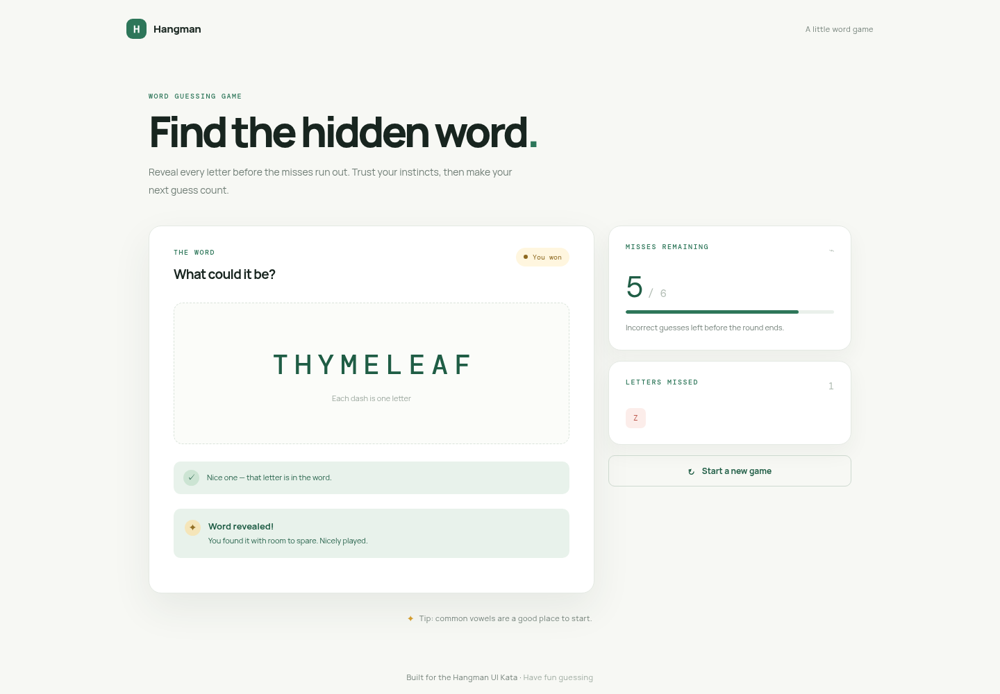

# Hangman UI Kata — Seed4J CLI Model Experiment

This repository preserves a controlled technical evaluation of three Codex models implementing the same Hangman specification with Seed4J CLI. It compares observed outcomes; because there is no no-Seed4J control, it does not establish that Seed4J caused any result.

## Experiment

Every run started from the same [frozen base branch](https://github.com/renanfranca/seed4j-cli-hangman-ui-kata/tree/hangman-ui-kata-seed4j-base), received the same English prompt, ran at `xhigh` effort, and was preserved without human repairs:

```text
Implement the specification in SPEC.md. A functional user interface of your choice is a mandatory deliverable. Use the already-installed Seed4J CLI tool as support.
```

The controlled conditions were the repository, [specification](https://github.com/renanfranca/seed4j-cli-hangman-ui-kata/blob/039472297f20bbae15143ae49fd0b36206d68d69/SPEC.md), base commit, prompt, Seed4J CLI `0.0.4`, runtime `2.2.0` in `standard` mode, local Seed4J skill, sequential execution, and host. The changed variable was the model.

| Order | Model | Effort | Preserved branch | Pinned implementation | Score |
| ---: | --- | --- | --- | --- | ---: |
| 1 | `gpt-5.6-luna` | `xhigh` | [`hangman-ui-kata-luna-xhigh`](https://github.com/renanfranca/seed4j-cli-hangman-ui-kata/tree/hangman-ui-kata-luna-xhigh) | [`3a3de096`](https://github.com/renanfranca/seed4j-cli-hangman-ui-kata/commit/3a3de0969e87f08d845e5702abeee4227b4c42c3) | 89.99 |
| 2 | `gpt-5.6-terra` | `xhigh` | [`hangman-ui-kata-terra-xhigh`](https://github.com/renanfranca/seed4j-cli-hangman-ui-kata/tree/hangman-ui-kata-terra-xhigh) | [`a40a5d95`](https://github.com/renanfranca/seed4j-cli-hangman-ui-kata/commit/a40a5d95d450270173790f18c582fcc6d1d060cb) | 99.06 |
| 3 | `gpt-5.6-sol` | `xhigh` | [`hangman-ui-kata-sol-xhigh`](https://github.com/renanfranca/seed4j-cli-hangman-ui-kata/tree/hangman-ui-kata-sol-xhigh) | [`efdf2d2d`](https://github.com/renanfranca/seed4j-cli-hangman-ui-kata/commit/efdf2d2df9b72408a8190f5934d5c23433382f1b) | 98.50 |

## Findings

All three implementations passed the frozen public `BALLOON` domain scenario and browser flows for initial, correct, incorrect, invalid, duplicate, won, and lost states. Terra ranked first under the fixed 100-point rubric. Sol had complete native requirement coverage but lost points for duplicated Seed4J initialization history and UI-component cohesion. Luna delivered a functional Spring/Thymeleaf UI but had no UI-facing native tests or enforced coverage gate, and its wrapper module commit absorbed handwritten implementation files.

Terra's runner status remains `failed` because its implementation commit reformatted `SPEC.md`, changing the frozen byte hash. The runner status did not automatically determine the score; the fixed rubric scored executable behavior and its named engineering criteria. See [MODEL_EVALUATION.md](MODEL_EVALUATION.md) for requirement-level results, deductions, immutable evidence, commands, and limitations.

## Visual evidence

Seven `1440 × 1000` PNGs are stored for each model under [`evidence/screenshots`](evidence/screenshots). These representative won states link to the complete per-model sequences.

| Luna | Terra | Sol |
| --- | --- | --- |
| [](evidence/screenshots/luna-xhigh) | [](evidence/screenshots/terra-xhigh) | [](evidence/screenshots/sol-xhigh) |

## Try Seed4J CLI Yourself

The observed experiment used Seed4J CLI `0.0.4`, runtime `2.2.0` in `standard` mode, Java `25.0.2`, Node.js `24.16.0`, and npm `11.13.0`. Seed4J CLI itself requires Java 25 or newer; its npm launcher and development tooling require Node.js 22 or newer.

Install the observed CLI for a close reproduction:

```bash
npm install -g seed4j-cli@0.0.4
seed4j --version
```

Or install the latest unpinned CLI for a new experiment:

```bash
npm install -g seed4j-cli
seed4j --version
```

Install the repository-local agent skill from a project root:

```bash
seed4j skill install
```

That command writes `.agents/skills/seed4j-cli`. For this exact experiment, start from the frozen base branch where the skill is already pinned; do not reinstall it over the frozen copy. Start or restart Codex at the repository root so the local skill is discovered.

Use one new branch and one new Codex task per run:

```bash
git clone https://github.com/renanfranca/seed4j-cli-hangman-ui-kata.git
cd seed4j-cli-hangman-ui-kata
git switch --create <new-run-branch> origin/hangman-ui-kata-seed4j-base
sha256sum SPEC.md
seed4j --version
```

Choose a new model/effort, submit the exact frozen prompt once, and do not expose previous implementation content to that task. Preserve its result before validation or comparison. Validate with the implementation's native wrapper and scripts, inspect Git and `.seed4j/modules`, then optionally repeat the public acceptance harness documented in the detailed report.

A newer CLI/runtime, a changed local skill, a different base, or a changed prompt is a new experiment rather than an exact reproduction.

Authoritative references:

- [Seed4J CLI repository and documentation](https://github.com/seed4j/seed4j-cli)
- [Official OpenAI documentation: Build skills](https://learn.chatgpt.com/docs/build-skills)

## License

The evaluation documentation is available under the [Apache License 2.0](LICENSE). Preserved implementation branches retain their recorded file contents and metadata.
